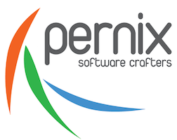

# Playbook

Este es el Playbook para los colaboradores de Pernix, en este documento se describen las politicas de la compañía, los beneficios y las guías necesarias para ejecutar el trabajo desde tu primer día en la empresa. En este README también encontrará información de como contribuir con este documento.

## Nuestra misión
Formar profesionales que fomenten la prosperidad económica del país entregando soluciones innovadores a la sociedad y nuestros clientes artesanado software de calidad

## Nuestra visión
Ser la mejor opción para que nuestros clientes formen una relación de por vida con nosotros

## Nuestros valores
* Profesionalismo
* Responsabilidad personal
* Excelencia técnica
* Liderazgo
* Aprendizaje
* Colaboración

Puede [leer más del significado de cada uno de nuestros valores](/)

## Nuevos colaboradores
* [Previo al ingreso](recruiting/before_onboarding.md)
* [Primer dia en la oficina](recruiting/onboarding.md)

## Guías
* [Guía de actividades](guides/activities.md)
* [Guía de beneficios](guides/benefits.md)
